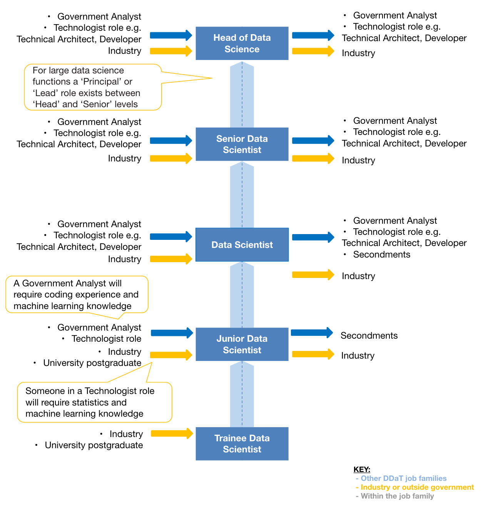

## DRAFT: THIS IS NOT A STATEMENT OF GOVERNMENT POLICY

# Data Scientist 

**Developed by the Digital, Data and Technology Profession in collaboration with the Government Analytical Professions (GES, GORS, GSE, GSR & GSS)**

This document has been put together in consultation with the Data Science community across government. It will be iterated further as the community evolves. It should be noted that the definitions and terminology within the document have been chosen to represent as close to a common definition as possible for the role, skills and capabilities across government. In constructing this common definition we recognise that terminology used here will not always match the terminology used in all departments. 

# About the Role

## The value delivered
* Uses large and varied datasets to tackle complex business problems that often span a range of services or departments
* Applies their technical expertise in a range of coding, statistics and machine learning disciplines to produce innovative approaches
* Works with a range of other professions in a collaborative, agile manner to understand the problem and structure analytical approaches using a wider range of data than is normally used in that business area
* Builds scalable data products that can be used by strategic or operational users and can be further integrated into business systems
* Communicates the value of the data product to stakeholders and convince them of the data science opportunity

## The career promise
You will:
* Improve government services using data and make a meaningful difference to people's lives
* Revolutionise government by solving large, challenging problems using data science approaches
* Build up a strong portfolio of data-intensive projects as a hands-on technical leader
* Demonstrate your technical leadership by coding on a regular (ideally daily) basis, at all levels of seniority
* Gain technical experience working in multidisciplinary, agile teams
* Belong to a high-profile, well-respected cross government data science community

# The Role

This section provides detailed descriptions of the role and role levels. This includes the specific capabilities required at each level to have a successful career as a Data Scientist in government, as well as the typical career paths available. The role levels are intended as a framework to be drawn upon and therefore will change depending on the size and complexity of each department.

<table align='left' style='width: 95%;'>
	<tbody valign="top">
		<tr>
			<td>
				<h3>Role</h3>
			</td>
			<td>
				<h3>Role description and key responsibilities</h3>
			</td>
		</tr>
		<tr>
			<td>
				
Data Scientist

			</td>
			<td>
				
Data Scientists identify complex business problems whilst leveraging data value. They work as part of a multidisciplinary team with Data Architects, Data Engineers, Analysts and others. They work with policy and operations teams to understand where data science can add value. They support strategic and operational decision making. They source, access, manipulate and engineer data processes with data that typically have characteristics of volume, velocity and/or variety. They build credible statistical models from the data and use best coding practices to generate reproducible work. They may draw on other technical and analytical standards from across government and industry. They adhere to the data science ethics framework. They are open minded and demonstrate strong intellectual curiosity. They have an interdisciplinary focus, using techniques and knowledge from across the scientific spectrum.

				
In their role, Data Scientists explore and visualise the data, to present the ‘story’ of the data in a meaningful way to a range of technical and non-technical audiences. They use an evolving range of data analysis tools and techniques, including open source - some of which they learn quickly, as and when required. They continuously seek to expand their range of technical skills in addition to their leadership and communications development and propagate data science skills in other teams; understanding the variety of functional roles relating to data science and how they can be most effectively applied to solve business problems. Data Scientists work in an open, transparent and collaborative manner, sharing good practice and seeking to continuously improve the quality of outputs. 

			</td>
		</tr>
	</tbody>
</table>

## Role Levels
This section focuses on the five role levels within the Data Scientist role. In larger projects there can be a ‘Lead’ role that sits between the ‘Head’ and ‘Senior’ role levels. 

<table align='left' style='width: 95%;'>
	<tbody valign="top">
		<tr>
			<td>
				<h3>Role level</h3>
			</td>
			<td>
				<h3>Description of role level and common activities</h3>
			</td>
		</tr>
		<tr>
			<td>
				
Head of Data Science

			</td>
			<td>
				
Head of Data Science provides leadership and direction across a programme of multidisciplinary data science projects, managing resources to ensure delivery. They are recognised as a strategic authority with technical expertise in cutting-edge techniques, defining vision across the organisation. They are a role model to other Data Scientists and champion adoption of best practice. They communicate with senior stakeholders and convince them of the strategic value of applying data science.

			</tr>
			<tr>
				<td>
					
Senior Data Scientist

				</td>
				<td>
					
Senior Data Scientists are experienced Data Scientists who provide support and guidance to teams. They are a recognised authority on a number of data science specialisms within government, with some knowledge of cutting-edge techniques. They may work on projects of high political exposure, value or complexity. They engage with senior stakeholders and champion the value of data science. They line manage more junior colleagues. They communicate the value of data science to senior stakeholders. 

				</td>
			</tr>
			<tr>
				<td>
					
Data Scientist

				</td>
				<td>
					
Data Scientists are proficient in data science. They have recognised technical ability in a number of data science specialisms and provide detailed technical advice on their area of expertise. They draw on other technical and analytical standards from across government and industry. They promote and present data science work both within and outside of the organisation. They engage with stakeholders the value of data science work and propagate data science skills in other teams. They line manage and mentor junior data scientists and manage small project teams.

				</td>
			</tr>
			<tr>
				<td>
					
Junior Data Scientist

				</td>
				<td>
					
Junior Data Scientists are responsible for aspects of existing data science projects, whilst gaining valuable hands-on experience. They are able to apply certain data science techniques and work to develop their technical ability. They adhere to the data science ethics framework. They work as part of a multidisciplinary team with Data Architects, Data Engineers, Analysts and others and provide limited advice on data science projects within teams. They identify and communicate lessons learnt during projects and follow good practice. They clearly communicate the value of data science work to stakeholders.

				</td>
			</tr>
			<tr>
				<td>
					
Trainee Data Scientist

				</td>
				<td>
					
Trainee Data Scientists are given experience of practical data science work under supervision from more senior colleagues. They move from a strong awareness of the core data science skills of coding, machine learning and statistics to a more effective working knowledge. They develop their understanding of how to apply data science to business problems.

			</td>
		</tr>
	</tbody>
</table>

# Capabilities  

The Digital, Data and Technology profession capabilities have been mapped across two levels: essential capabilities and desired capabilities. Essential capabilities are a “must have” and desired capabilities are a “nice to have” for the job family.

## Capability Types

There are two types of capability that apply to each job family.
<table align='left' style='width: 95%;'>
	<tbody valign="top">
		<tr>
			<td>
				<h3>1. Technical Capabilities
</h3>
			</td>
			<td>
				<h3>2. Core Competencies
</h3>
			</td>
		</tr>
		<tr>
			<td>
				
Technical capabilities relate to functions, processes and roles within the organisation and include the knowledge and skill in the exercise of practices required for the accomplishment of a specific job or task.

			</td>
			<td>
				
Core competencies are problem solving behaviours used appropriately and responsibly in the management of personal and professional affairs. They are a set of human skills acquired via teaching or direct experience that are used to handle problems and questions commonly encountered in daily life.

			</td>
		</tr>
		<tr>
			<td>
				

					<b>Examples:</b>
					<i> Data Science Innovation, Developing data science capability etc.</i>
				

			</td>
			<td>
				

					<b>Examples:</b>
					<i> Seeing the Bigger Picture, Collaborating and Partnering, Changing and Improving etc.</i>
				

			</td>
		</tr>
	</tbody>
</table>

## Levels of Mastery

Technical capabilities have varying levels of mastery within each role level. The 4 levels of mastery commonly used across the Civil Service were applied and are defined below (in descending order):

<table align='left' style='width: 95%;'>
	<tbody valign="top">
		<tr>
			<td>
				<h3>Capability
</h3>
			</td>
			<td>
				<h3>Description of level of mastery
</h3>
			</td>
		</tr>
		<tr>
			<td>
				

					<b>Expert</b>
				

			</td>
			<td>
				
Has knowledge and experience in application of this capability. Is a recognised specialist and advisor in this capability including user needs, generation of ideas, methods, tools and leading or guiding others in best practice use.

			</td>
		</tr>
		<tr>
			<td>
				

					<b>Practitioner</b>
				

			</td>
			<td>
				
Shares knowledge and experience of the capability with others, including tools and techniques, defining those most appropriate for the environment.

			</td>
		</tr>
		<tr>
			<td>
				

					<b>Working</b>
				

			</td>
			<td>
				
Applies knowledge and experience of the capability, including tools and techniques, adopting those most appropriate for the environment.

			</td>
		</tr>
		<tr>
			<td>
				

					<b>Awareness</b>
				

			</td>
			<td>
				
Has knowledge of the capability and an appreciation of how it’s applied in the environment.

			</td>
		</tr>
	</tbody>
</table>

# Capability Descriptions

## Technical Capabilities

Technical capabilities have been sourced from the Data Science community.

<table align='left' style='width: 95%;'>
	<tbody valign="top">
		<tr>
			<td>
				<h3></h3>
			</td>
			<td>
				<h3>Description
</h3>
			</td>
		</tr>
		<tr>
			<td>
				

					<b>Developing data science capability</b>
				

			</td>
			<td>
				

Continuously develops data science knowledge, utilising multiple sources. Shares data science practices cross-department and in industry, promoting professional development and use of best practice across all capabilities identified for Data Scientists.

			</td>
		</tr>
		<tr>
			<td>
				

					<b>Data Science Innovation</b>
				

			</td>
			<td>
				

Recognises and exploits business opportunities to ensure more efficient and effective ways to use data science. Explores ways of utilising new data science tools and techniques to tackle business and organisational challenges. Demonstrates strong intellectual curiosity with an interdisciplinary approach, drawing on innovation in academia and industry.

			</td>
		</tr>
		<tr>
			<td>
				

					<b>Applied mathematics, statistics and scientific practices</b>
				

			</td>
			<td>
				

Understands how algorithms are designed, optimised and applied at scale. Can select and use appropriate statistical methods for sampling, assessment of distributions, bias and error. Understands problem structuring methods and can evaluate when each method is appropriate. Applies scientific methods through experimental design, exploratory data analysis and hypothesis testing to reach robust conclusions.

			</td>
		</tr>
		<tr>
			<td>
				

					<b>Understanding Analysis Across the Life Cycle
</b>
				

			</td>
			<td>
				

Understands the different phases of product delivery and is able to plan and run the analysis for these. Able to contribute to decision-making throughout the life cycle. Works in collaboration with User Researchers, Developers and other roles throughout the life cycle. Understands the value of analysis, how to contribute with impact, and what data sources, analytical techniques and tools can be used at each point throughout the life cycle.

			</td>
		</tr>
		<tr>
			<td>
				

					<b>Domain Expertise
</b>
				

			</td>
			<td>
				

Understands the context of the business and its priorities. Applies data science techniques to present, communicate and disseminate data science products effectively, appropriately and with high impact.  Uses the most appropriate medium to visualise data to tell compelling and actionable stories relevant for business goals. Maintains a user focus to design solutions to meet user need taking account of agreed cross-government ethics standards.

			</td>
		</tr>
		<tr>
			<td>
				

					<b>Data Engineering and Manipulation
</b>
				

			</td>
			<td>
				

Works with other technologists and analysts to integrate and separate data feeds in order to map, produce, transform, and test new scalable data products that meet user needs. Has a demonstrable understanding of how to expose data from systems (e.g. through APIs), link data from multiple systems and deliver streaming services. Works with other technologists and analysts to understand and make use of different types of data models. Understands and can make use of different data engineering tools for repeatable data processing and is able to compare between different data models. Understands how to build scalable machine learning pipelines and combine feature engineering with optimisation methods to improve the data product performance.

			</td>
		</tr>
		<tr>
			<td>
				

					<b>Programming and build
</b>
				

			</td>
			<td>
				

Uses a range of coding practices to build scalable data products that can be used by strategic or operational users and can be further integrated into business systems. Works with technologists to design, create, test and document these data products. Works in accordance with agreed software development standards including consideration for security, accessibility and version control.

			</td>
		</tr>
	</tbody>
</table>

## Levels of Mastery Detailed Definitions for Technical Capabilities

<table align='left' style='width: 95%;'>
	<tbody valign="top">
		<tr>
			<td></td>
			<td>
				<h3>Mastery level</h3>
			</td>
			<td>
				<h3>Description</h3>
			</td>
		</tr>
		<tr>
			<td rowspan="4">
				<b>Developing data science capability</b>
			</td>
			<td>
				<b>Awareness</b>
			</td>
			<td>Develops their data science skills and knowledge through line management directed and self-directed learning. Shares their learning through the team when appropriate. Supports the cross government Data Science community.</td>
		</tr>
		<tr>
			<td>
				<b>Working</b>
			</td>
			<td>Develops their data science knowledge through self-directed learning and shares their learning through the team when appropriate. Identifies professional development opportunities for Data Scientists.</td>
		</tr>
		<tr>
			<td>
				<b>Practitioner</b>
			</td>
			<td>Promotes and monitors continuous professional development within their organisation. Develops knowledge of cutting-edge techniques and shares knowledge. Propagates data science capability across their organisation.</td>
		</tr>
		<tr>
			<td>
				<b>Expert</b>
			</td>
			<td>Advocates the importance of continuous learning to data science team and propagates data science capability to the wider organisation and into industry. Is a role model of best practice through demonstration of their own self-directed learning.</td>
		</tr>
		<tr>
			<td rowspan="4">
				<b>Data Science Innovation</b>
			</td>
			<td>
				<b>Awareness</b>
			</td>
			<td>Displays intellectual curiosity and has some awareness of innovation and emerging trends in industry.</td>
		</tr>
		<tr>
			<td>
				<b>Working</b>
			</td>
			<td>Displays intellectual curiosity and proactively explores areas of innovation. Can identify the business value for innovations within their team.</td>
		</tr>
		<tr>
			<td>
				<b>Practitioner</b>
			</td>
			<td>Displays strong intellectual curiosity and proactively explores areas of innovation. Can identify the business value for innovations within their organisation.</td>
		</tr>
		<tr>
			<td>
				<b>Expert</b>
			</td>
			<td>Is a thought leader in their organisation. Predicts future areas of innovation and can show how it can be applied to their organisation and wider government.</td>
		</tr>
		<tr>
			<td rowspan="4">
				<b>Applied mathematics, statistics and scientific practices</b>
			</td>
			<td>
				<b>Awareness</b>
			</td>
			<td>Understands the theoretical basis for applied practices and is beginning to be able to apply the theory to practical examples.</td>
		</tr>
		<tr>
			<td>
				<b>Working</b>
			</td>
			<td>Has broad knowledge of how and when to practically apply existing best practice solutions.</td>
		</tr>
		<tr>
			<td>
				<b>Practitioner</b>
			</td>
			<td>Understands and can help teams apply a range of practices and developing deeper expertise on a narrower range of specialisms. Starts to apply emerging theory to practical situations.</td>
		</tr>
		<tr>
			<td>
				<b>Expert</b>
			</td>
			<td>Understands, teaches and supervises a wide range of practices although may have deep expertise on a narrower range of specialisms.  Able to apply emerging theory to practical situations.</td>
		</tr>
		<tr>
			<td rowspan="4">
				<b>Understanding Analysis Across the Life Cycle</b>
			</td>
			<td>
				<b>Awareness</b>
			</td>
			<td>Is aware of the need for careful analysis of data to produce clear insights.</td>
		</tr>
		<tr>
			<td>
				<b>Working</b>
			</td>
			<td>Understands and can work with colleagues to apply core techniques for analysis and providing insight. Presents clear insights that colleagues can understand and use.</td>
		</tr>
		<tr>
			<td>
				<b>Practitioner</b>
			</td>
			<td>Understands and can help teams apply a range of techniques to analyse data and provide insight. Is proactive and can present compelling findings that inform wider decisions. Starts to apply innovative approaches to resolve problems.</td>
		</tr>
		<tr>
			<td>
				<b>Expert</b>
			</td>
			<td>Understands, teaches and supervises a wide range of analysis techniques. Can help organisations create and learn from strategic insights. Able to apply innovative approaches to resolve problems.
</td>
		</tr>
		<tr>
			<td rowspan="4">
				<b>Domain Expertise</b>
			</td>
			<td>
				<b>Awareness</b>
			</td>
			<td>Understands the context of the business and the role of data science within the organisation.  Can create basic visuals and presentations to communicate data science products effectively.  Aware that data, analysis and how the two are communicated needs to be aligned to meet user needs. Understands how data governance works and how it relates to other organisational governance structures. Aware of the data science ethical framework and can apply this to their work. 
</td>
		</tr>
		<tr>
			<td>
				<b>Working</b>
			</td>
			<td>Understands the benefit of using data science products within the business based on the business and user requirements. Can communicate data science products, including the data, analysis and visualisations effectively, using media tailored to the audience.  Understands what data governance is required and can apply the data science ethical framework to their work.</td>
		</tr>
		<tr>
			<td>
				<b>Practitioner</b>
			</td>
			<td>Can create data science products which are proportionate to the business benefit and achieve significant impact. Presents analysis and visualisations in clear ways to communicate complex messages. Develops data science communication skills within their team. Supports the evolution of data governance and takes responsibility for applying the data science ethical framework in their business area.
</td>
		</tr>
		<tr>
			<td>
				<b>Expert</b>
			</td>
			<td>Communicates the business benefit of data science products, championing and governing these across the organisation. Can communicate relevant, compelling stories in the most appropriate medium. Ensures data governance and data ethics are embedded in organisational strategy. Aligns data science priorities with wider organisational objectives (e.g. budget).
</td>
		</tr>
		<tr>
			<td rowspan="4">
				<b>Data Engineering and Manipulation</b>
			</td>
			<td>
				<b>Awareness</b>
			</td>
			<td>Understands the technical principles underpinning data feeds (both streaming and batch types) for consumption by data products. Can explain how existing tools can be applied to create these feeds. Is aware of ad-hoc data exploration techniques that can be used to build datasets for data consumers.
</td>
		</tr>
		<tr>
			<td>
				<b>Working</b>
			</td>
			<td>Can work with Data Engineers to map, produce, transform, and test new data feeds for data owners and data consumers, using tools and technologies already in use in the business area.
Can conduct ad-hoc data exploration in common data serialisation and storage formats used across the business to build datasets for data consumers.</td>
		</tr>
		<tr>
			<td>
				<b>Practitioner</b>
			</td>
			<td>Can work with Data Engineers to map, produce, transform, and test new data feeds for data owners and consumers, selecting the most appropriate tools and technologies. Can lead ad-hoc data exploration in a wide variety of data serialisation and storage formats from across the business to build datasets for data consumers.</td>
		</tr>
		<tr>
			<td>
				<b>Expert</b>
			</td>
			<td>Has significant experience building data pipelines at scale using a range of tools and technologies and can advise on data engineering best practices across industry. Can lead ad-hoc data exploration practices in their business area by identifying and setting the best practice standards. Identifies opportunities for future innovation of data exploration practices.</td>
		</tr>
		<tr>
			<td rowspan="4">
				<b>Programming and build</b>
			</td>
			<td>
				<b>Awareness</b>
			</td>
			<td>Understands and has a basic knowledge of how software components are developed and built.</td>
		</tr>
		<tr>
			<td>
				<b>Working</b>
			</td>
			<td>Designs, codes, tests, corrects and documents simple programs or scripts under the direction of others as part of a multi-disciplinary team.</td>
		</tr>
		<tr>
			<td>
				<b>Practitioner</b>
			</td>
			<td>Designs, codes, tests, corrects and documents moderate to complex programs and scripts from agreed specifications and subsequent iterations, using agreed standards and tools. Collaborates with others to review specifications where appropriate.</td>
		</tr>
		<tr>
			<td>
				<b>Expert</b>
			</td>
			<td>Sets local or team-based standards for programming tools and techniques and selects appropriate development methods. Advises on the application of standards and methods and ensures compliance. Takes technical responsibility for all stages and/or iterations in a software development project, providing method specific technical advice and guidance to project stakeholders.</td>
		</tr>
	</tbody>
</table>

## Levels of Mastery for Essential Technical Capabilities

The levels of mastery (from awareness to expert) have been mapped against the role levels for the Data Scientist role for each technical capability. An overview of the mapping for each of the capabilities can be seen below and is followed by detailed definitions of the levels of mastery per capability.

### Overview

<table align='left' style='width: 95%;'>
	<tbody valign="top">
		<tr>
			<td>
				<h3></h3>
			</td>
			<td>
				<h3>Trainee Data Scientist
</h3>
			</td>
			<td>
				<h3>Junior Data Scientist
</h3>
			</td>
			<td>
				<h3>Data Scientist
</h3>
			</td>
			<td>
				<h3>Senior Data Scientist
</h3>
			</td>
			<td>
				<h3>Head of Data Science
</h3>
			</td>
		</tr>
		<tr>
			<td>
				

					<b>Developing data science capability </b>
				

			</td>
			<td>
				
Awareness

			</td>
			<td>
				
Working

			</td>
			<td>
				
Practitioner

			</td>
			<td>
				
Practitioner

			</td>
			<td>
				
Expert

			</td>
		</tr>
		<tr>
			<td>
				

					<b>Data Science Innovation</b>
				

			</td>
			<td>
				
Awareness

			</td>
			<td>
				
Working

			</td>
			<td>
				
Practitioner

			</td>
			<td>
				
Expert

			</td>
			<td>
				
Practitioner

			</td>
		</tr>
		<tr>
			<td>
				

					<b>Applied mathematics, statistics and scientific practices</b>
				

			</td>
			<td>
				
Awareness

			</td>
			<td>
				
Working

			</td>
			<td>
				
Practitioner

			</td>
			<td>
				
Expert

			</td>
			<td>
				
Practitioner

			</td>
		</tr>
		<tr>
			<td>
				

					<b>Understanding Analysis Across the Life Cycle</b>
				

			</td>
			<td>
				
Awareness

			</td>
			<td>
				
Working

			</td>
			<td>
				
Practitioner

			</td>
			<td>
				
Expert

			</td>
			<td>
				
Practitioner

			</td>
		</tr>
		<tr>
			<td>
				

					<b>Domain Expertise</b>
				

			</td>
			<td>
				
Awareness

			</td>
			<td>
				
Working

			</td>
			<td>
				
Practitioner

			</td>
			<td>
				
Practitioner

			</td>
			<td>
				
Expert

			</td>
		</tr>
		<tr>
			<td>
				

					<b>Data Engineering and Manipulation</b>
				

			</td>
			<td>
				
Awareness

			</td>
			<td>
				
Working

			</td>
			<td>
				
Practitioner

			</td>
			<td>
				
Expert

			</td>
			<td>
				
Practitioner

			</td>
		</tr>
		<tr>
			<td>
				

					<b>Programming and build</b>
				

			</td>
			<td>
				
Awareness

			</td>
			<td>
				
Awareness

			</td>
			<td>
				
Working

			</td>
			<td>
				
Practitioner

			</td>
			<td>
				
Working

			</td>
		</tr>
	</tbody>
</table>

## Core Competencies
Core competencies have been sourced from the Civil Service Competency Framework. The following capabilities were identified as essential capabilities for the Data Scientist role. 

<table align='left' style='width: 95%;'>
	<tbody valign="top">
		<tr>
			<td>
				<h3></h3>
			</td>
			<td>
				<h3>Civil Service Competency
</h3>
			</td>
		</tr>
		<tr>
			<td>
				
Seeing the Bigger Picture

			</td>
			<td>
				
Seeing the big picture is about having an in-depth understanding and knowledge of how your role fits with and supports organisational objectives and the wider public needs and the national interest. For all staff, it is about focusing your contribution on the activities which will meet Civil Service goals and deliver the greatest value. For leaders, it is about scanning the political context and taking account of wider impacts to develop long term implementation strategies that maximise opportunities to add value to the citizen and support economic, sustainable growth.

			</td>
		</tr>
		<tr>
			<td>
				
Changing and Improving

			</td>
			<td>
				
People who are effective in this area take initiative, are innovative and seek out opportunities to create effective change. For all staff, it’s about learning from what has worked as well as what has not, being open to change and improvement, and working in ‘smarter’, more focused ways. For leaders, this is about creating and encouraging a culture of innovation and allowing people to consider and take informed decisions. Doing this well means continuously seeking out ways to improve policy implementation and build a leaner, more flexible and responsive Civil Service. It also means making use of alternative delivery models including digital and shared service approaches wherever possible.

			</td>
		</tr>
		<tr>
			<td>
				
Delivering at Pace

			</td>
			<td>
				
Effectiveness in this area means focusing on delivering timely performance with energy and taking responsibility and accountability for quality outcomes. For all staff, it’s about working to agreed goals and activities and dealing with challenges in a responsive and constructive way. For leaders, it is about building a performance culture where staff are given space, authority and support to deliver outcomes. It’s also about keeping a firm focus on priorities and addressing performance issues resolutely, fairly and promptly.

			</td>
		</tr>
		<tr>
			<tr>
				<td>
					
Collaborating and Partnering

				</td>
				<td>
					
People skilled in this area are team players. At all levels, it requires working collaboratively, sharing information appropriately and building supportive, trusting and professional relationships with colleagues and a wide range of people within and outside the Civil Service, whilst having the confidence to challenge assumptions. For senior leaders, it’s about being approachable, delivering business objectives through creating an inclusive environment, welcoming challenge however uncomfortable.

				</td>
			</tr>
			<tr>
				<td>
					
Leading and Communicating

				</td>
				<td>
					
At all levels, effectiveness in this area is about showing our pride and passion for public service, communicating purpose and direction with clarity, integrity, and enthusiasm. It’s about championing difference and external experience, and supporting principles of fairness of opportunity for all. For leaders, it is about being visible, establishing a strong direction and persuasive future vision; managing and engaging with people in a straightforward, truthful, and candid way.

				</td>
			</tr>
			<tr>
				<td>
					
Delivering Value for Money

				</td>
				<td>
					
Delivering value for money involves the efficient, effective and economic use of taxpayers’ money in the delivery of public services. For all staff, it means seeking out and implementing solutions which achieve the best mix of quality, and effectiveness for the least outlay. People who do this well base their decisions on evidenced information and follow agreed processes and policies, challenging these appropriately where they appear to prevent good value for money. For leaders it’s about embedding a culture of value for money within their area/function. They work collaboratively across boundaries to ensure that the Civil Service maximises its strategic outcomes within the resources available.

				</td>
			</tr>
		</tbody>
	</table>

## Career Paths

The diagram below outlines some of the common entry and exit points at each role level within the career path, as well as any additional comments relating to the role. Names of roles outside of the Data Scientist role will be updated as other DDaT job families are developed. The career path structure will continue to be refined by the Data Scientist role.

### Data Scientist Career Paths

## Digital, Data and Technology Profession Team

E: ddatprofession-info@digital.cabinet-office.gov.uk

W: [gov.uk/government/organisations/digital-data-and-technology-professions](http://www.gov.uk/government/organisations/digital-data-and-technology-professions)

